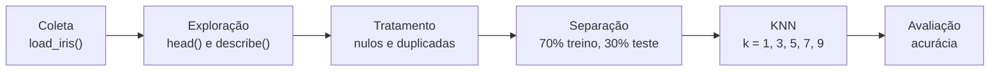

# 🌸 Dataset Iris: análise e modelo KNN


Checkpoint 2 do curso de **Tecnólogo em Inteligência Artificial da FIAP**, nas disciplinas de
**Machine Learning & Modelling** e **Statistical Computing**.

Exploramos e tratamos o dataset Iris (Parte 1) e treinamos um classificador **KNN** para prever a
espécie de uma flor a partir das suas medidas (Parte 2). A apresentação foi montada como um app em
Streamlit, onde o código roda ao vivo durante os slides.

[](https://iris-knn-fiap.streamlit.app)

---

## 🌼 O dataset

O Iris foi popularizado pelo estatístico Ronald Fisher em 1936, com medidas coletadas pelo botânico
Edgar Anderson. É um dos datasets mais usados para aprender Machine Learning.

| | |
|---|---|
| **Flores** | 150 (50 de cada espécie) |
| **Espécies** | setosa, versicolor e virginica |
| **Medidas (cm)** | comprimento e largura da sépala, comprimento e largura da pétala |

## 🔄 O que o código faz



**Parte 1: Statistical Computing**

- Carregamos o dataset e montamos um DataFrame com as 4 medidas e a coluna `especie`.
- Exploramos a estrutura com `head()` e `describe()`. O comprimento da pétala tem o maior desvio
  padrão e a média abaixo da mediana, um sinal de que essa medida separa bem as espécies.
- Verificamos valores ausentes (nenhum) e linhas duplicadas (uma, que foi removida).
  O dataset tratado ficou com **149 flores**.

**Parte 2: Machine Learning**

- Separamos as medidas (`X`) do gabarito (`y`).
- Dividimos em **104 flores para treino** e **45 para teste**, com `random_state=42` para o
  resultado ser sempre o mesmo.
- Treinamos e avaliamos o KNN com 1, 3, 5, 7 e 9 vizinhos.

## 🧠 Como o KNN decide

> *"Diga-me com quem andas e te direi quem és."*

Para classificar uma flor nova, o modelo mede a distância dela até todas as flores do treino, pega
as **K mais próximas** e a espécie mais votada entre elas vence. No KNN, "treinar" é só guardar os
dados: todo o trabalho acontece na hora da previsão.

## 📊 Resultados

| Valor de k | Acurácia |
|:---:|:---:|
| 1 | 1,0 |
| 3 | 1,0 |
| 5 | 1,0 |
| 7 | 1,0 |
| 9 | 1,0 |

**Por que 100% em todos?** O Iris é um dataset fácil: a setosa se separa sozinha das outras
espécies. Além disso, o teste tem só 45 flores, então cada erro valeria cerca de 2,2 pontos
percentuais. Com todos os valores de k empatados, essa divisão não permite apontar o melhor k.
O próximo passo seria usar **validação cruzada**, que repete a avaliação com várias divisões
diferentes.

## 🎤 A apresentação em Streamlit

Em vez de slides estáticos, a apresentação é um app com **18 slides**:

- **Código explicado linha a linha**, com o resultado de cada trecho gerado na hora.
- **Demonstração ao vivo:** ajuste as medidas de uma flor e o valor de K e veja a espécie prevista,
  a votação dos vizinhos e onde a flor cai no gráfico.
- **Navegação** pelos botões Anterior e Próximo, pelas setas do teclado (ou passador de slides) e
  por uma lista para pular direto a qualquer slide.

## 📁 Estrutura do repositório

```
checkpoint-iris-knn/
├── .streamlit/
│   └── config.toml                       # tema claro com o rosa da FIAP
├── apresentacao.py                       # apresentação em Streamlit (18 slides)
├── app.py                                # app extra para explorar o modelo
├── Checkpoint2_Iris_KNN.ipynb            # notebook original do Colab
├── Checkpoint2_Iris_KNN_com_codigo.pdf   # apresentação em PDF
├── requirements.txt                      # bibliotecas necessárias
└── README.md
```

## ▶️ Como rodar no seu computador

```bash
git clone https://github.com/SEU-USUARIO/checkpoint-iris-knn.git
cd checkpoint-iris-knn
python -m pip install -r requirements.txt
python -m streamlit run apresentacao.py
```

O navegador abre sozinho. Para apresentar, aperte **F11** para ficar em tela cheia.

## 🛠️ Tecnologias

| Ferramenta | Para que usamos |
|---|---|
| **pandas** | Organizar e explorar os dados em tabela |
| **scikit-learn** | Dataset, divisão treino/teste, modelo KNN e acurácia |
| **Streamlit** | Apresentação interativa |
| **Plotly** | Gráfico da demonstração ao vivo |
| **Google Colab** | Desenvolvimento do notebook |

## 👥 Equipe

| | |
|---|---|
| Gustavo Seiji Miyakawa | Guilherme Bitencourt |
| Lucas Koiti Yoshikava | Renata Machado |
| Naiara Sousa Soares | Manuela Prieto Fazzato |

---

<sub>FIAP · Tecnólogo em Inteligência Artificial · Checkpoint 2</sub>
